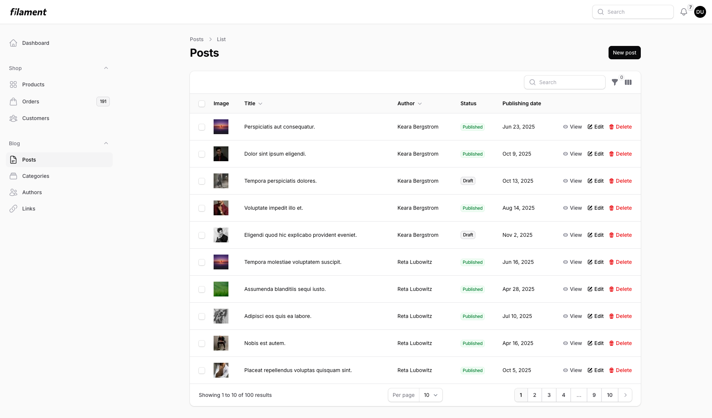
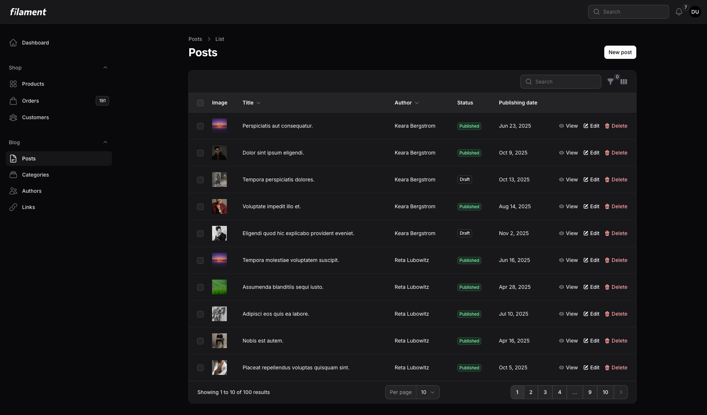
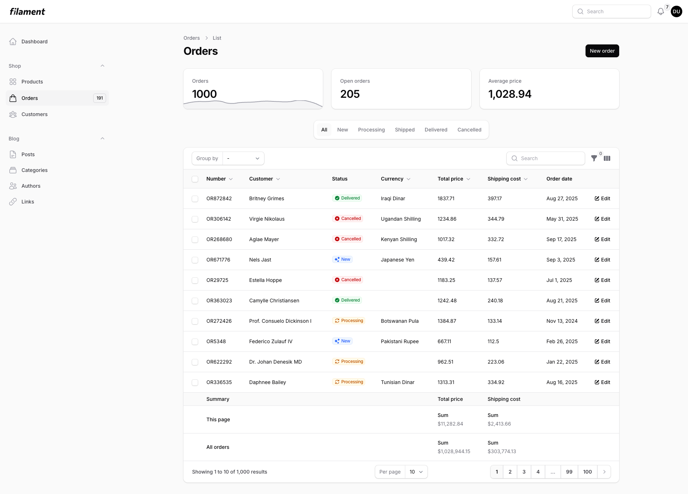
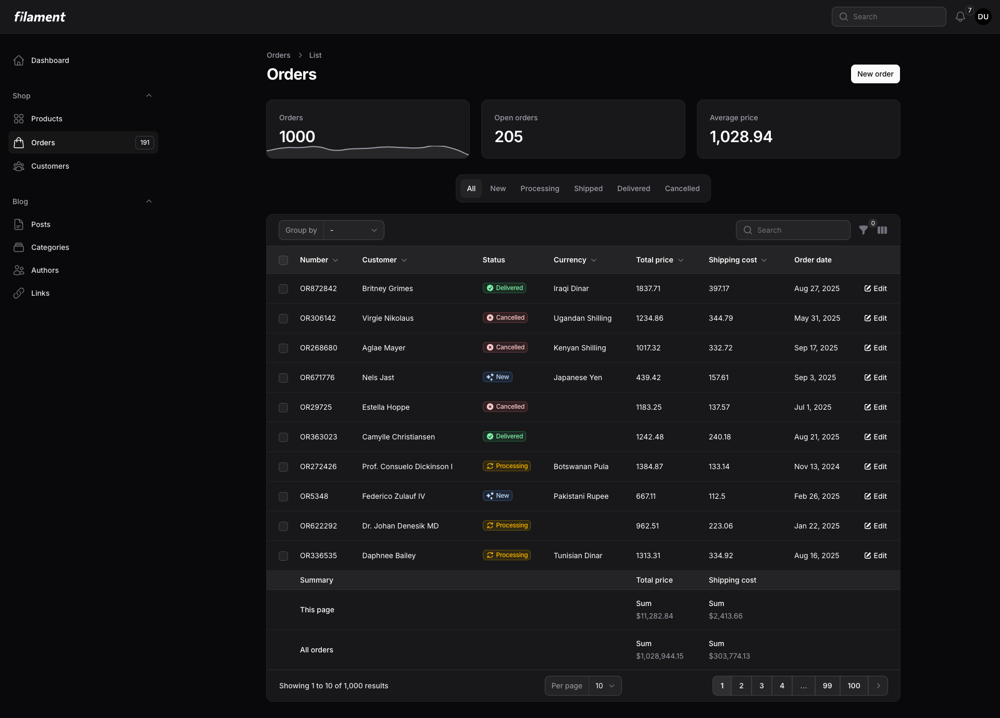

# Filament Shadcn Theme

**The only Filament theme that changes colors between light and dark modes** — just like Shadcn UI.

[](https://packagist.org/packages/openplain/filament-shadcn-theme)
[](https://packagist.org/packages/openplain/filament-shadcn-theme)

## Why This Package?

Filament's built-in themes keep the same colors in both light and dark modes. A blue button stays blue. Always.

**Shadcn changes the game** — the Default theme creates sophisticated contrast with inverted colors:
- **Light mode**: Dark charcoal buttons that command attention
- **Dark mode**: Light gray buttons that feel native

This is the Shadcn magic. Now available for Filament.

## Screenshots

<div align="center">
<table>
<tr>
<td align="center">

<br>
<b>Light Mode</b> - Dark buttons on light background
</td>
<td align="center">

<br>
<b>Dark Mode</b> - Light buttons on dark background
</td>
</tr>
<tr>
<td align="center">

<br>
<b>Orders List</b> - With stats and filters
</td>
<td align="center">

<br>
<b>Perfect contrast</b> - In both modes
</td>
</tr>
</table>
</div>

## Installation

```bash
composer require openplain/filament-shadcn-theme
```

## Basic Usage

Add to your Panel Provider (e.g., `app/Providers/Filament/AdminPanelProvider.php`):

```php
use Openplain\FilamentShadcnTheme\Color;

public function panel(Panel $panel): Panel
{
    return $panel
        ->colors([
            'primary' => Color::Default,  // The Shadcn effect
        ]);
}
```

## All 8 Official Themes

```php
Color::Default  // Inverted grays (Shadcn's signature)
Color::Red      // Vibrant red
Color::Rose     // Soft rose
Color::Orange   // Warm orange
Color::Green    // Fresh green
Color::Blue     // Classic blue
Color::Yellow   // Bright yellow
Color::Violet   // Rich violet
```

Based on the official themes from [ui.shadcn.com/themes](https://ui.shadcn.com/themes).

## Advanced: Custom Adaptive Colors

Want your brand blue in light mode but teal in dark mode? Use the `adaptive()` method:

```php
use Filament\Support\Colors\Color as FilamentColor;

'primary' => Color::adaptive(
    lightColor: FilamentColor::Blue,
    darkColor: FilamentColor::Teal
)
```

Perfect for:
- Brands requiring specific contrast ratios
- Seasonal color changes
- Multi-tenant applications with theme requirements

## Requirements

- PHP 8.1+
- Filament 4.0+

## License

The MIT License (MIT). Please see [License File](LICENSE.md) for more information.

---

<div align="center">
Built with ❤️ by <a href="https://openplain.dev">Openplain</a>
</div>